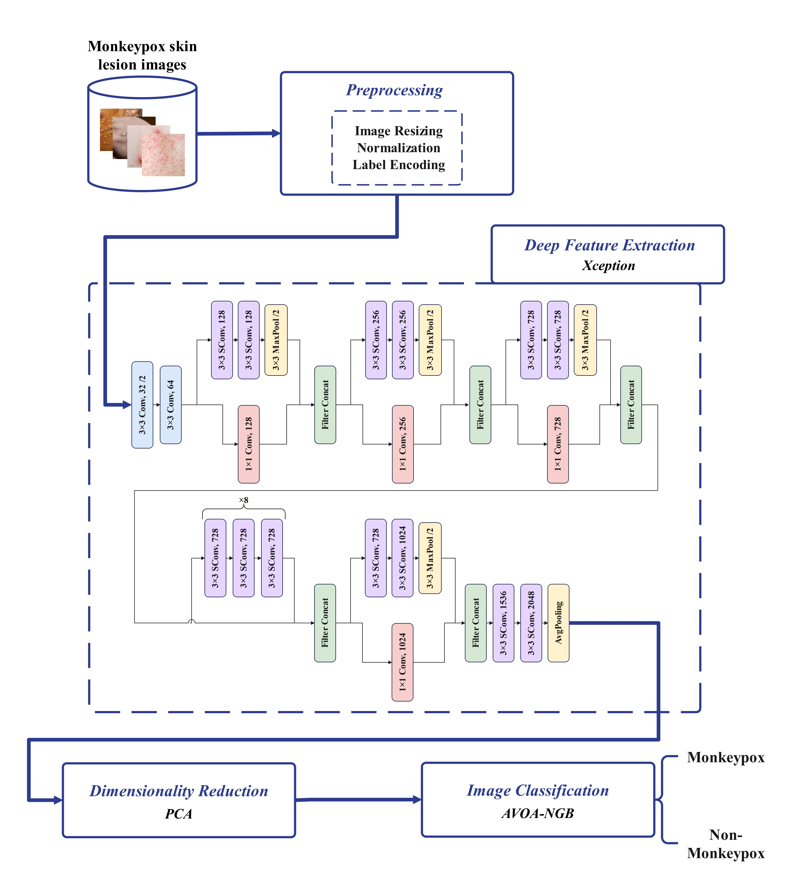

# An Explainable Nature-Inspired Framework for Monkeypox Diagnosis: Xception Features Combined with NGBoost and African Vultures Optimization Algorithm

##  Abstract

The recent global spread of monkeypox, especially in non-endemic regions, has raised significant public health concerns. Early and accurate diagnosis is critical for effective disease management and control. In response, this repository presents a novel deep learning-based framework for **automated detection of monkeypox from skin lesion images**, leveraging:

- **Transfer Learning** via the Xception model for feature extraction,
- **Principal Component Analysis (PCA)** for dimensionality reduction,
- **Natural Gradient Boosting (NGBoost)** for classification, and
- **African Vultures Optimization Algorithm (AVOA)** for hyperparameter tuning.

The model was trained and evaluated on the publicly available **Monkeypox Skin Lesion Dataset (MSLD)** and achieved **97.53% accuracy**, **97.72% F1-score**, and **97.47% AUC**.

Additionally, Grad-CAM and LIME visualization techniques are employed to enhance model interpretability.

---

##  Dataset

The **Monkeypox Skin Lesion Dataset (MSLD)** used in this study is publicly available on Kaggle:

🔗 [MSLD on Kaggle](https://www.kaggle.com/datasets/nafin59/monkeypox-skin-lesion-dataset)

- 228 original images (102 Monkeypox, 126 Others - Chickenpox/Measles)
- Augmented set: 3192 images (1428 Monkeypox, 1764 Others)
- CSV file with labels provided

---

## Methodology

1. **Data Preprocessing:**  
   - Image resizing  
   - Normalization  
   - Label encoding  

2. **Feature Extraction:**  
   - Using Xception for deep feature extraction  

3. **Dimensionality Reduction:**  
   - PCA to reduce feature space  

4. **Classification:**  
   - NGBoost, tuned with AVOA  

5. **Interpretability:**  
   - Grad-CAM and LIME visualization for model decisions


Our proposed methodology is illustrated in the following diagram:  



---

## How to Run

Follow these steps to set up and run the project:

### Step 1: Clone the Repository  
First, clone the GitHub repository to your local machine:  
```bash
git clone https://github.com/username/MonkeyPox-XNG-AVOA.git
cd MonkeyPox-XNG-AVOA
```

### Step 2: Create a Virtual Environment (Recommended)
It is recommended to use a virtual environment to manage dependencies:
```bash
python -m venv env
source env/bin/activate  # On Windows: env\Scripts\activate
```

### Step 3: Install Dependencies
Install the required libraries from the requirements.txt file:
```bash
pip install -r requirements.txt
```

### Step 4: Launch Jupyter Notebook

---


